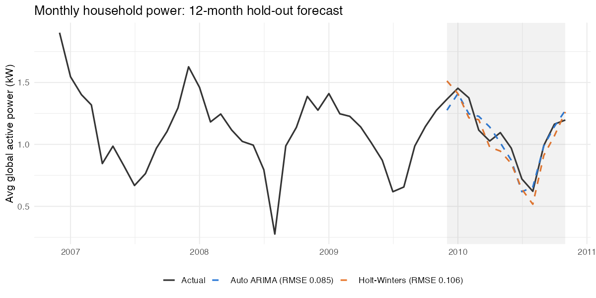

# Household Power Consumption Forecasting (R)

Forecasts monthly household electricity use with classical exponential smoothing and seasonal ARIMA models, then compares them on a 12-month hold-out set.

**Tools:** R · forecast · astsa · tseries · dplyr · lubridate · zoo · ggplot2

## Data
[UCI Individual Household Electric Power Consumption](https://archive.ics.uci.edu/dataset/235/individual+household+electric+power+consumption): about 2 million minute-level readings (Dec 2006 – Nov 2010), aggregated to monthly average `Global_active_power`.
Download and unzip `household_power_consumption.txt` into `data/` (it's too large to keep in the repo).

## Workflow
1. Cleaning and interpolating missing values (`na.approx`), then aggregating to a monthly series
2. Normality check (Shapiro–Wilk) and additive vs multiplicative decomposition, plus STL/MSTL
3. **Holt-Winters** (additive vs multiplicative) and ETS
4. Stationarity tests (**ADF, KPSS**), ACF/PACF and seasonal differencing
5. Manual **SARIMA** search (Ljung-Box and AIC) vs `auto.arima`
6. Out-of-sample comparison on the last 12 months (RMSE)

## Results


| Model | Hold-out RMSE (kW) |
|---|---|
| Holt-Winters (additive) | 0.106 |
| **Auto ARIMA**, SARIMA(0,0,0)(0,1,0)[12] | **0.085** |

The series has strong yearly seasonality and fairly constant variance, so an additive structure fits. Both models track the seasonal dip well, and **Auto ARIMA cut forecast error by about 20%**. Holt-Winters stays attractive because it's simpler to explain.

## Run it
```r
install.packages(c("dplyr","lubridate","zoo","ggplot2","forecast","astsa","tseries","psych"))
source("power_forecasting.R")   # full analysis
source("plot_holdout.R")        # regenerates the chart above
```

---
*MSc Data Science & Analytics, Munster Technological University (Time Series Analysis)*
